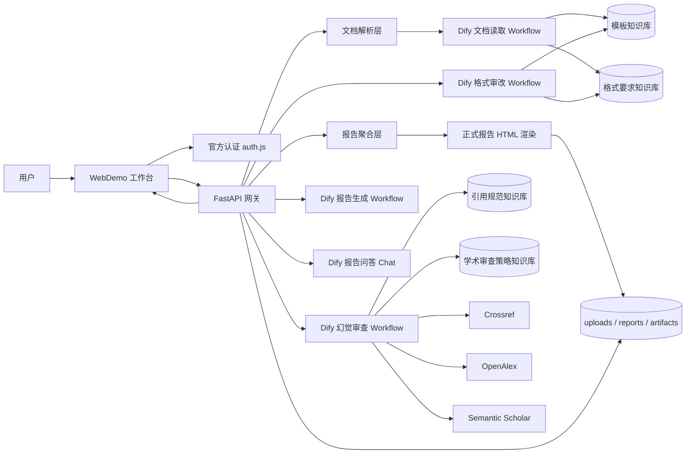
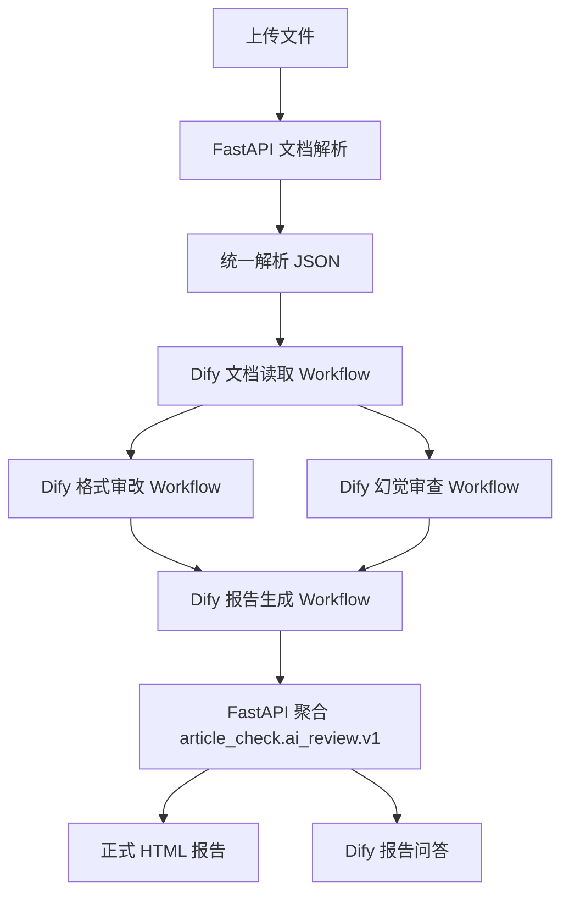
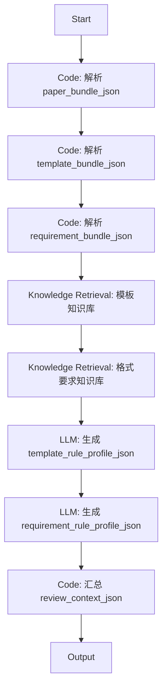
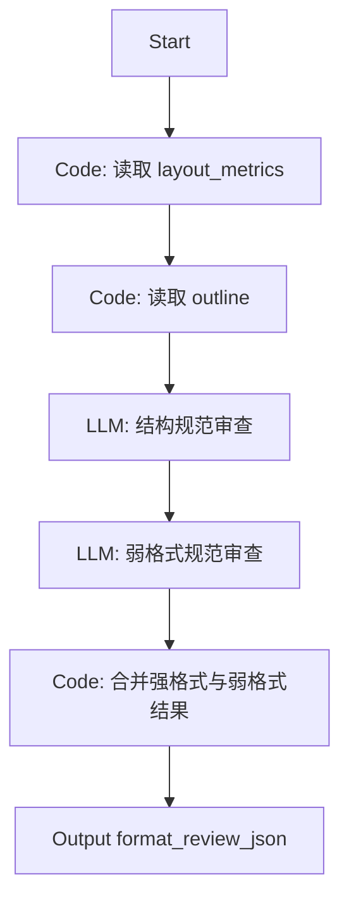
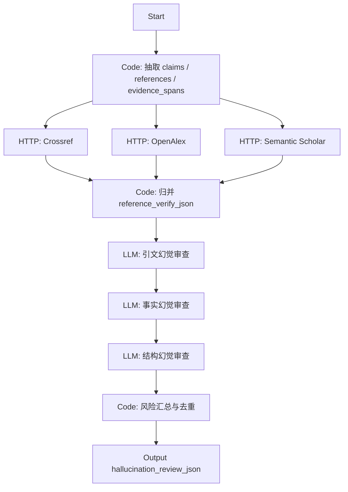
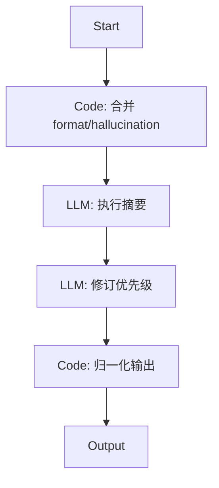
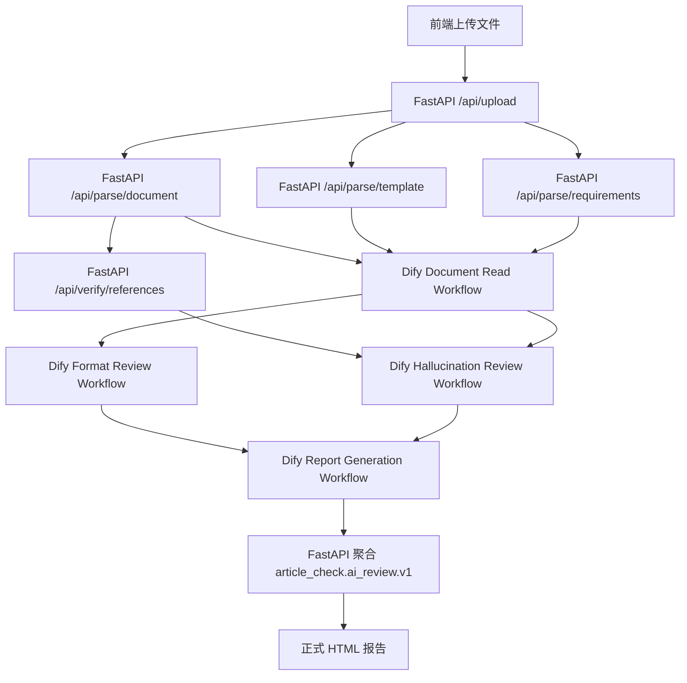
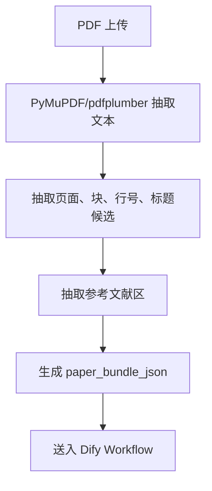
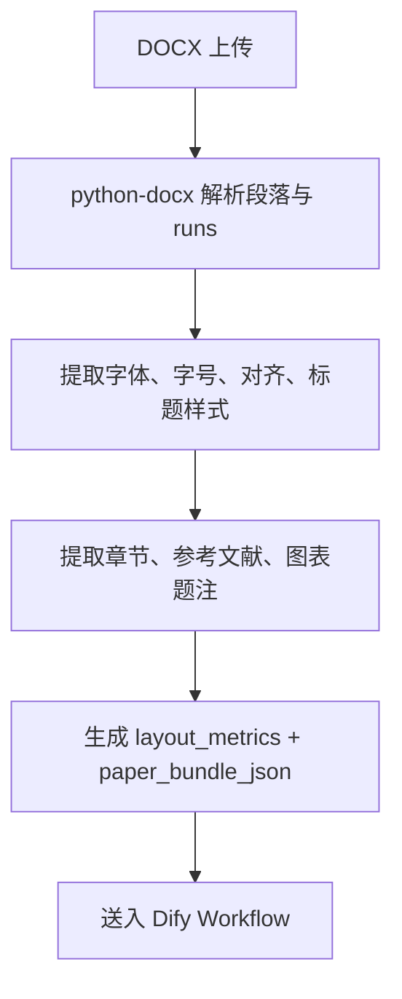
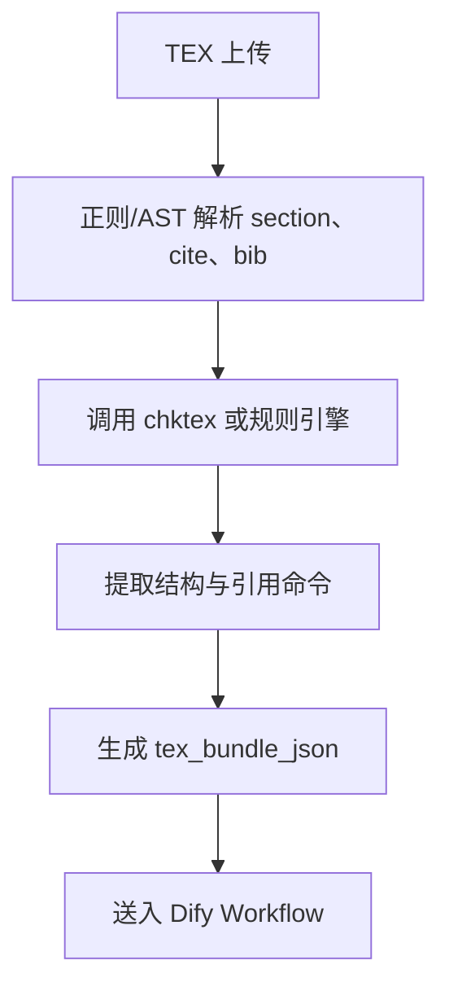

# Dify 驱动的格式审改与论文幻觉审查平台最终设计

## 1. 文档定位

- 文档名称：Dify 驱动的格式审改与论文幻觉审查平台最终设计
- 目标：重构当前平台，使 `WebDemo + FastAPI 网关 + Dify 多应用编排 + 项目方官方认证 + Docker 托管` 成为统一主线
- 适用对象：Dify 编排人员、后端工程师、平台工程师、项目负责人
- 输出重点：
  - Dify 文档读取 Workflow 节点设计
  - FastAPI 文档解析接口输入输出 JSON
  - `PDF/DOCX/TEX -> Dify` 的完整对接流程
  - 面向格式审改与论文幻觉审查的科学工作流设计

## 2. 问题重述

当前平台已经具备：

- WebDemo 工作台
- FastAPI 报告网关
- `DifyClient`
- 基础文件上传
- 结构化报告 `article_check.ai_review.v1`

但现状仍存在关键断层：

1. `/api/review` 仍主要走本地确定性链路
2. `ContentWorker` 与 Dify 的关系较弱，Dify 还不是主干
3. 文档读取、格式语义理解、论文幻觉审查、报告生成尚未拆成可运营的 Dify 应用
4. 文件解析与 LLM 判断没有完全分层

因此需要把系统改造成：

- `FastAPI` 负责文件接入、底层格式解析、证据落盘、正式报告渲染
- `Dify` 负责文档读取编排、格式审改、论文幻觉审查、报告生成、报告问答

## 3. 设计原则

### 3.1 证据优先

所有高风险判断都必须能追溯到：

- 原始文件
- 解析结果
- 外部学术元数据
- Dify 输出节点

### 3.2 解析与推理分层

- 文件格式解析由 `FastAPI` / 外部解析器负责
- 审查判断与生成由 `Dify Workflow` 负责

### 3.3 强格式与弱格式分离

- 强格式问题：
  - 字体
  - 字号
  - 页边距
  - 行距
  - 对齐方式
  - 标题样式
  - 图表题注版式
- 弱格式 / 语义格式问题：
  - 章节缺失
  - 结构不完整
  - 摘要不规范
  - 参考文献字段不完整

强格式问题不能只依赖 LLM，必须来源于解析器。

### 3.4 幻觉审查分层

“论文幻觉审查”拆成 3 类：

1. 引文幻觉
   - 正文声称引用，但参考文献不存在
   - DOI、题名、作者、年份不一致
2. 事实幻觉
   - 文中论断缺少证据支撑
   - 与引用文献内容不一致
3. 结构幻觉
   - 声称有实验、图表、结论，但正文中没有充分支持

## 4. 总体目标架构



## 5. 目标应用拆分

建议将 Dify 拆成 5 个应用，而不是 1 个“大而全” Chat：

| 应用名 | 类型 | 作用 |
| --- | --- | --- |
| `ArticleCheck_Document_Read_Workflow` | Workflow | 文档读取、结构抽取、规则抽取 |
| `ArticleCheck_Format_Review_Workflow` | Workflow | 格式审改 |
| `ArticleCheck_Hallucination_Review_Workflow` | Workflow | 引文幻觉、事实幻觉、结构幻觉审查 |
| `ArticleCheck_Report_Generation_Workflow` | Workflow | 汇总审查结果，生成结构化报告 |
| `ArticleCheck_Report_Chat` | Chat | 基于结构化报告问答 |

## 6. 科学工作流总览



## 7. 平台重构建议

## 7.1 当前平台保留

以下部分继续留在当前代码仓库：

1. `WebDemo` 页面
2. 官方认证 `auth.js`
3. FastAPI API 网关
4. 文件上传与路径管理
5. 原文片段定位与报告导出
6. `article_check.ai_review.v1` 聚合格式
7. 正式报告 HTML/PDF 渲染

## 7.2 当前平台重构

需要新增或调整：

1. 新增 `Document Parse API`
2. 新增 `Reference Verify API`
3. 将 `/api/review` 改为 Dify 多 Workflow 编排入口
4. 将 `ContentWorker` 弱化为兼容层，不再作为主干
5. 将 `build_runtime()` 重构为：
   - 文件解析
   - Dify 工作流调度
   - 聚合报告

## 8. Dify 驱动的文档读取 Workflow 设计

## 8.1 目标

`Document Read Workflow` 不直接承担强格式判断，而是承担：

- 文本读取
- 章节抽取
- 元信息抽取
- 引用段落抽取
- 模板和规范文本归一化
- 生成后续审查输入上下文

## 8.2 输入变量

| 变量名 | 类型 | 说明 |
| --- | --- | --- |
| `paper_bundle_json` | string | FastAPI 返回的论文解析 JSON |
| `template_bundle_json` | string | 模板解析 JSON |
| `requirement_bundle_json` | string | 格式要求解析 JSON |
| `institution` | string | 学校 / 单位 |
| `template_name` | string | 模板名 |
| `review_goal` | string | 审查目标 |

## 8.3 输出变量

| 变量名 | 类型 | 说明 |
| --- | --- | --- |
| `paper_profile_json` | object | 论文概况、章节、摘要、参考文献区信息 |
| `template_rule_profile_json` | object | 模板规则语义抽取 |
| `requirement_rule_profile_json` | object | 格式要求语义抽取 |
| `review_context_json` | object | 后续 Workflow 通用上下文 |

## 8.4 节点图



## 8.5 节点说明

### 节点 1：Start

输入：

- `paper_bundle_json`
- `template_bundle_json`
- `requirement_bundle_json`
- `institution`
- `template_name`

### 节点 2：Code - Parse Paper Bundle

职责：

- 将 FastAPI 传入的字符串 JSON 转成对象
- 校验必需字段存在

输出建议：

```json
{
  "paper_title": "string",
  "file_type": "pdf|docx|tex",
  "paper_text": "string",
  "outline": [],
  "references": [],
  "layout_metrics": {}
}
```

### 节点 3：Knowledge Retrieval - 模板知识库

检索内容：

- 学校模板规则
- 章节示例
- 标题层级规范

### 节点 4：Knowledge Retrieval - 格式要求知识库

检索内容：

- 字号
- 字体
- 页边距
- 图表题注
- 页眉页脚
- 参考文献体例

### 节点 5：LLM - 规则归一化

职责：

- 把检索出的模板规则和规范文本归一化成可比对 JSON

建议输出：

```json
{
  "required_sections": ["摘要", "引言", "相关工作", "结论"],
  "title_rules": {
    "level_1": {"font": "黑体", "size": "三号"}
  },
  "caption_rules": {
    "alignment": "center"
  }
}
```

### 节点 6：Code - 汇总 Review Context

输出 `review_context_json`：

```json
{
  "paper_profile": {},
  "template_rules": {},
  "format_requirements": {},
  "review_goal": "本科毕业论文送审前复核"
}
```

## 9. Dify 驱动的格式审改 Workflow 设计

## 9.1 目标

输出两类问题：

1. 解析器已经明确测得的强格式问题
2. 结合规则语义判断出的结构与规范问题

## 9.2 输入变量

| 变量名 | 类型 | 说明 |
| --- | --- | --- |
| `paper_bundle_json` | string | FastAPI 论文解析 JSON |
| `review_context_json` | string | 文档读取 Workflow 输出 |
| `format_policy_json` | string | 可选附加策略 |

## 9.3 输出变量

| 变量名 | 类型 | 说明 |
| --- | --- | --- |
| `format_review_json` | object | 格式审改结果 |
| `format_evidence_json` | object | 格式证据 |

## 9.4 节点图



## 9.5 强格式与弱格式融合逻辑

### 强格式来源

来自 FastAPI 解析器：

- `font_mismatches`
- `margin_mismatches`
- `line_spacing_issues`
- `alignment_issues`
- `caption_issues`

### 弱格式来源

来自 LLM 规则判断：

- 章节缺失
- 标题层级不完整
- 摘要结构不完整
- 图表说明不充分

## 9.6 输出 JSON 建议

```json
{
  "score": 0.0,
  "summary": "发现 12 条格式问题，其中 3 条为高优先级。",
  "issues": [
    {
      "type": "font_mismatch",
      "severity": "major",
      "description": "一级标题字体不符合模板要求",
      "suggestion": "调整为黑体三号",
      "location": {"page": 2, "line": 14},
      "evidence_type": "deterministic"
    },
    {
      "type": "missing_section",
      "severity": "major",
      "description": "缺少相关工作章节",
      "suggestion": "补充相关工作并说明与现有研究差异",
      "location": {"section": "相关工作"},
      "evidence_type": "semantic"
    }
  ]
}
```

## 10. Dify 驱动的论文幻觉审查 Workflow 设计

## 10.1 定义

论文幻觉审查包括：

1. `citation_hallucination`
   - 引文不存在
   - 引文元数据错误
   - 引文与论断不匹配
2. `claim_hallucination`
   - 文中论断缺乏引文支撑
   - 文中结论无法从正文证据推导
3. `structure_hallucination`
   - 摘要、结论、实验结果互相不一致
   - 声称有实验验证，但正文缺少结果支撑

## 10.2 输入变量

| 变量名 | 类型 | 说明 |
| --- | --- | --- |
| `paper_bundle_json` | string | 论文解析结果 |
| `review_context_json` | string | 文档读取上下文 |
| `reference_verify_json` | string | FastAPI 外部学术核验结果 |
| `hallucination_policy_json` | string | 幻觉审查策略 |

## 10.3 输出变量

| 变量名 | 类型 | 说明 |
| --- | --- | --- |
| `hallucination_review_json` | object | 幻觉审查结果 |
| `hallucination_evidence_json` | object | 幻觉证据 |

## 10.4 节点图



## 10.5 核心判断原则

### 引文幻觉

- 仅当外部元数据与文中引用明显不一致时，才判定高风险
- 仅当正文存在引用声明但参考文献中不存在对应条目时，才判定严重问题

### 事实幻觉

- 不允许模型凭空说“该论文在编造事实”
- 只能输出：
  - “该论断未在提供上下文中找到充分证据”
  - “该论断与引用条目摘要/主题不一致”

### 结构幻觉

- 比对摘要、正文、结论、实验结果四个部分的一致性

## 10.6 输出 JSON 建议

```json
{
  "score": 0.0,
  "summary": "发现 5 条潜在幻觉风险，其中 2 条为引文高风险问题。",
  "issues": [
    {
      "type": "citation_hallucination",
      "severity": "critical",
      "description": "正文引用 [12] 所对应的参考文献条目无法在外部数据库中核验",
      "suggestion": "核对参考文献题名、作者、年份和 DOI",
      "location": {"section": "相关工作"},
      "evidence": {
        "reference_id": "12",
        "crossref_hit": false,
        "openalex_hit": false
      }
    },
    {
      "type": "claim_hallucination",
      "severity": "major",
      "description": "摘要中声称方法显著优于现有方法，但正文未给出充分实验对比证据",
      "suggestion": "补充量化实验对比并在摘要中降低绝对化表述",
      "location": {"section": "摘要"}
    }
  ]
}
```

## 11. Dify 驱动的报告生成 Workflow 设计

## 11.1 输入变量

| 变量名 | 类型 | 说明 |
| --- | --- | --- |
| `paper_bundle_json` | string | 论文解析结果 |
| `format_review_json` | string | 格式审改结果 |
| `hallucination_review_json` | string | 幻觉审查结果 |
| `review_context_json` | string | 文档上下文 |

## 11.2 输出变量

| 变量名 | 类型 | 说明 |
| --- | --- | --- |
| `executive_summary` | string | 执行摘要 |
| `priority_actions_json` | object | 修订行动清单 |
| `review_payload_delta_json` | object | 供 FastAPI 聚合的报告差量 |

## 11.3 节点图



## 12. Dify 报告问答 Chat 设计

输入：

- `report_payload`
- `user_question`

系统约束：

- 必须仅基于 `report_payload`
- 不得添加报告中不存在的事实
- 不得把“潜在风险”说成“已被证实”

## 13. FastAPI 文档解析接口设计

## 13.1 设计目标

FastAPI 负责：

1. 接收论文、模板、格式要求文档
2. 针对不同文件类型做底层解析
3. 输出统一结构化 JSON
4. 为 Dify Workflow 提供稳定输入

## 13.2 推荐接口列表

| 接口 | 方法 | 作用 |
| --- | --- | --- |
| `/api/parse/document` | POST | 解析论文文件 |
| `/api/parse/template` | POST | 解析模板文件 |
| `/api/parse/requirements` | POST | 解析格式要求文件 |
| `/api/verify/references` | POST | 引文外部核验 |
| `/api/review/orchestrate` | POST | 统一调度 Dify 多 Workflow |

## 13.3 `/api/parse/document`

### 请求 JSON

```json
{
  "file_path": "uploads/abcd1234.docx",
  "file_type": "docx",
  "extract_layout": true,
  "extract_references": true,
  "extract_sections": true
}
```

### 响应 JSON

```json
{
  "status": "ok",
  "data": {
    "document_id": "doc_001",
    "paper_title": "多智能体论文审查系统设计",
    "file_type": "docx",
    "paper_text": "全文文本",
    "outline": [
      {"level": 1, "title": "摘要", "start_line": 1, "end_line": 20},
      {"level": 1, "title": "引言", "start_line": 21, "end_line": 80}
    ],
    "abstract_text": "摘要内容",
    "reference_section_text": "参考文献全文",
    "references": [
      {
        "ref_id": "ref_01",
        "raw_text": "Smith, 2020 ...",
        "title": "Paper title",
        "authors": ["Smith"],
        "year": 2020,
        "doi": null
      }
    ],
    "claims": [
      {
        "claim_id": "claim_01",
        "text": "本文方法显著优于基线方法",
        "section": "摘要",
        "citations": ["[12]"]
      }
    ],
    "layout_metrics": {
      "font_mismatches": [],
      "margin_mismatches": [],
      "line_spacing_issues": [],
      "alignment_issues": [],
      "caption_issues": []
    },
    "source_spans": [
      {
        "span_id": "span_001",
        "page": 2,
        "line": 14,
        "text": "原文片段"
      }
    ]
  }
}
```

## 13.4 `/api/parse/template`

### 请求 JSON

```json
{
  "file_path": "uploads/template_bnu.docx",
  "file_type": "docx"
}
```

### 响应 JSON

```json
{
  "status": "ok",
  "data": {
    "template_id": "tpl_bnu_001",
    "template_name": "北京师范大学本科毕业论文模板",
    "template_text": "模板全文文本",
    "layout_requirements": {
      "title_rules": {},
      "paragraph_rules": {},
      "caption_rules": {}
    },
    "section_requirements": ["摘要", "引言", "相关工作", "结论"]
  }
}
```

## 13.5 `/api/parse/requirements`

### 请求 JSON

```json
{
  "file_path": "uploads/requirements.pdf",
  "file_type": "pdf"
}
```

### 响应 JSON

```json
{
  "status": "ok",
  "data": {
    "requirement_id": "req_001",
    "requirement_text": "规范全文",
    "normalized_rules": {
      "font": {},
      "margins": {},
      "sections": [],
      "references": {}
    }
  }
}
```

## 13.6 `/api/verify/references`

### 请求 JSON

```json
{
  "references": [
    {
      "ref_id": "ref_01",
      "title": "Paper title",
      "authors": ["Smith"],
      "year": 2020,
      "doi": null
    }
  ]
}
```

### 响应 JSON

```json
{
  "status": "ok",
  "data": {
    "items": [
      {
        "ref_id": "ref_01",
        "crossref_hit": true,
        "openalex_hit": true,
        "semantic_scholar_hit": false,
        "matched_title": "Paper title",
        "matched_doi": "10.1000/xyz",
        "risk_level": "low"
      }
    ],
    "summary": {
      "total_refs": 1,
      "matched": 1,
      "unmatched": 0,
      "doi_missing": 1
    }
  }
}
```

## 13.7 `/api/review/orchestrate`

### 请求 JSON

```json
{
  "paper_path": "uploads/paper.docx",
  "template_path": "uploads/template.docx",
  "requirements_path": "uploads/requirement.pdf",
  "institution": "北京师范大学",
  "template_name": "本科毕业论文模板",
  "review_goal": "送审前格式与幻觉复核"
}
```

### 响应 JSON

```json
{
  "status": "ok",
  "data": {
    "report_format": "article_check.ai_review.v1",
    "meta": {},
    "summary": {},
    "sections": {
      "format_check": {},
      "hallucination_check": {},
      "reference_check": {},
      "workflow": {}
    },
    "findings": [],
    "evidence_records": [],
    "advice_report": {},
    "formal_report": {}
  }
}
```

## 14. PDF / DOCX / TEX 到 Dify 的完整对接流程

## 14.1 统一流程图



## 14.2 PDF 路线



特点：

- 适合语义抽取
- 版式精度有限
- 对字体字号判断应谨慎

## 14.3 DOCX 路线



特点：

- 最适合做强格式审改
- 适合模板化本科论文

## 14.4 TEX 路线



特点：

- 强结构可控
- 版式结果更多依赖规则和编译信息

## 15. Dify Service API 设计

## 15.1 文件上传

调用：

- `POST /files/upload`

用途：

- 上传原始论文文件、模板文件、规范文件
- 返回 `upload_file_id`

## 15.2 Workflow 运行

调用：

- `POST /workflows/run`

建议为每个 Workflow 使用独立 App Key，或者在网关中实例化多 `DifyClient`

## 15.3 Chat 运行

调用：

- `POST /chat-messages`

用途：

- 报告问答

## 15.4 Knowledge API

调用：

- `POST /datasets`
- `POST /datasets/{dataset_id}/document/create-by-file`
- `POST /datasets/{dataset_id}/document/create-by-text`

用途：

- 存储模板、格式规范、引用规范、学术审查策略

## 16. 建议的 Dify 输入输出规范

为了便于运营，所有 Workflow 建议统一以下约束：

### 输入统一前缀

- `paper_*`
- `template_*`
- `requirement_*`
- `review_*`

### 输出统一前缀

- `*_json`
- `*_summary`
- `*_evidence_json`

### 严格要求

1. 所有结构化输出必须为合法 JSON 对象
2. 不允许返回 markdown 代码块
3. 所有问题必须附带 `severity`
4. 所有高风险问题必须附带 `location` 或 `evidence`

## 17. 与当前代码的映射

| 当前代码位置 | 当前职责 | 重构后职责 |
| --- | --- | --- |
| `article_check/web/server.py` | 文件上传、审查入口、报告接口 | 新增解析接口与 Dify 编排入口 |
| `article_check/runtime.py` | 本地运行时与报告聚合 | 改为“Dify 调度 + 报告聚合” |
| `article_check/llm/client/dify.py` | 基础 Dify API 客户端 | 扩展为多 App Key / 多 Workflow 调度客户端 |
| `article_check/pipeline/worker.py` | 本地 Worker | 收缩为兼容层，主线转到 Dify |
| `ReviewPage.jsx` | 工作台 | 继续沿用，不迁移 |

## 18. 实施步骤

### Phase 1：解析接口落地

新增：

- `/api/parse/document`
- `/api/parse/template`
- `/api/parse/requirements`
- `/api/verify/references`

### Phase 2：Dify 工作流搭建

在线上 Dify 创建：

- `ArticleCheck_Document_Read_Workflow`
- `ArticleCheck_Format_Review_Workflow`
- `ArticleCheck_Hallucination_Review_Workflow`
- `ArticleCheck_Report_Generation_Workflow`
- `ArticleCheck_Report_Chat`

### Phase 3：统一编排入口

将当前 `/api/review` 重构为：

1. 本地解析
2. 文献核验
3. 调度 Dify 多 Workflow
4. 聚合报告

### Phase 4：上线联调

联调项：

1. Dify 输入输出变量
2. 外部学术 API 限流
3. 平台认证下的会话链路
4. HTML 报告导出与问答

## 19. 最终结论

对于当前项目，最优的最终架构不是：

- 把所有论文格式读取和幻觉审查都交给单个 LLM

而是：

1. `FastAPI` 做文件格式解析与证据抽取
2. `Dify Document Read Workflow` 做上下文归一化
3. `Dify Format Review Workflow` 做格式审改
4. `Dify Hallucination Review Workflow` 做引文与事实幻觉审查
5. `Dify Report Generation Workflow` 做执行摘要与修订清单
6. `FastAPI` 聚合为 `article_check.ai_review.v1`
7. `WebDemo` 负责最终交互、证据联动和正式报告展示

这条路线最符合你的平台目标：

- 可运营
- 可复核
- 可平台部署
- 可逐步替换当前本地链路
- 与 Dify 在线编排高度兼容

