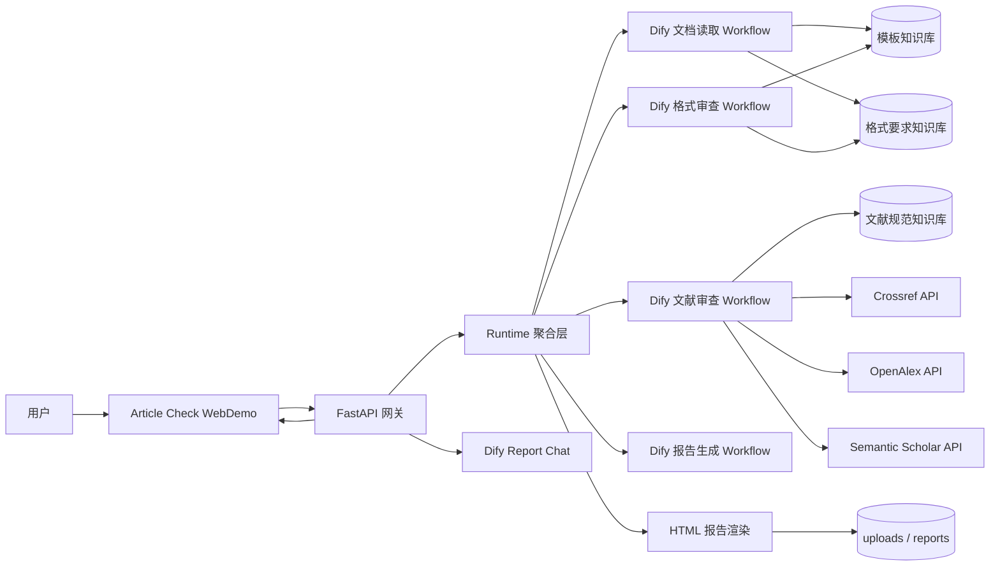
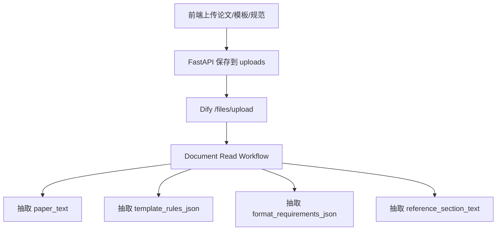
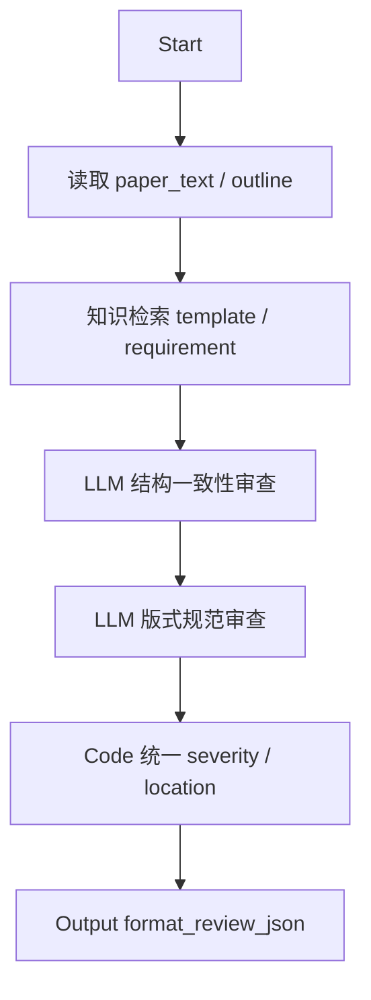
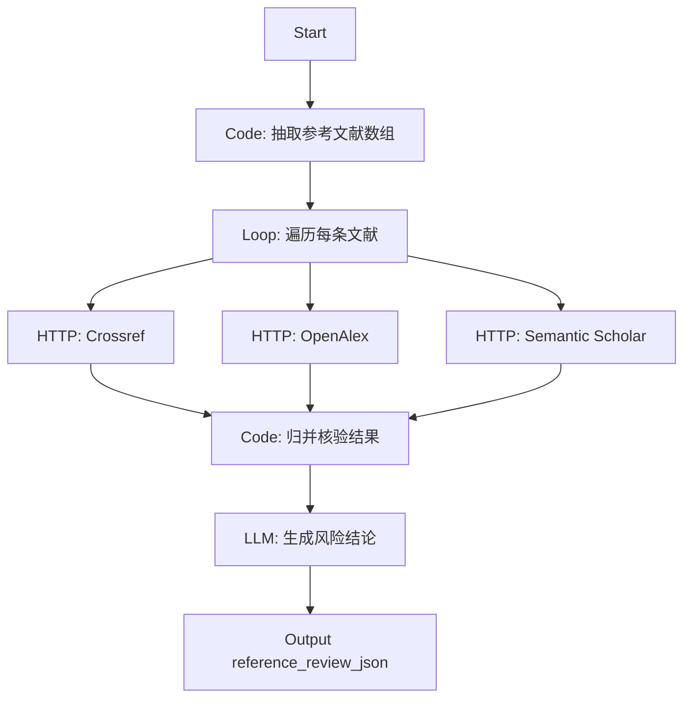

# Article Check 基于 Dify 的全链路驱动方案

## 1. 文档目标

本文档给出一套面向线上平台迁移的完整方案，使当前论文审查系统不再以 `DeepSeek` 为主干，而是以 `Dify Service API` 作为统一 AI 编排层，覆盖：

- 文档读取
  - 模板读取
  - 论文读取
  - 格式要求读取
- 审查
  - 格式审查
  - 文献审查
  - 内容审查
- 报告生成
  - 结构化报告 JSON
  - 正式报告 HTML
  - 报告问答

本文档同时约束一个重要原则：

- 前端仍保留 `Article Check WebDemo`
- 后端仍保留 `FastAPI` 作为网关、状态整合器和正式报告渲染器
- AI 与文档智能处理主线改由 Dify 驱动

## 2. 为什么必须改为 Dify 主驱动

当前项目虽然已经支持 `DifyClient`，但仍主要是：

1. `ContentWorker` 用 Dify/DeepSeek 做内容审查
2. 格式审查主要靠本地规则
3. 文献审查主要靠本地引用引擎 + 学术 API
4. 报告生成主要在本地运行时完成

如果目标是线上平台迁移、项目方托管、低代码运营和工作流可视化编排，那么需要进一步收束到：

1. 文档读取由 Dify Workflow 管理
2. 审查流程由 Dify Workflow 编排
3. 文件变量、知识库、HTTP 节点和结构化输出统一交给 Dify
4. 本项目保留“专业 UI + 正式报告渲染 + 证据联动”

## 3. Dify 官方能力边界

根据 Dify 官方 Service API 文档，当前适合本项目的官方接口主要包括：

- `POST /workflows/run`
  - 适合无状态、结构化、固定流程的审查任务
- `POST /chat-messages`
  - 适合围绕报告的问答
- `POST /files/upload`
  - 适合为 Workflow / Chat 传入文件变量
- `POST /datasets`
  - 创建知识库
- `POST /datasets/{dataset_id}/document/create-by-file`
  - 将模板、格式规范、学校要求文件入知识库
- `POST /datasets/{dataset_id}/document/create-by-text`
  - 将规则文本、审查策略文本入知识库

官方资料：

- Workflow API:
  - <https://raw.githubusercontent.com/langgenius/dify-docs/a958852d/en/api-reference/openapi_workflow.json>
- Chat API:
  - <https://raw.githubusercontent.com/langgenius/dify-docs/a958852d/en/api-reference/openapi_chat.json>
- Knowledge API:
  - <https://raw.githubusercontent.com/langgenius/dify-docs/a958852d/en/api-reference/openapi_knowledge.json>
- Chat App API 模板说明:
  - <https://raw.githubusercontent.com/langgenius/dify/main/web/app/components/develop/template/template_chat.en.mdx>

## 4. 迁移总原则

### 4.1 保留在本项目内的能力

以下能力不建议迁出：

1. WebDemo 页面
2. 用户上传管理与任务状态管理
3. 结构化报告聚合
4. 正式报告 HTML/PDF 渲染
5. Evidence 到原文联动
6. `/api/*` 网关

### 4.2 迁入 Dify 的能力

以下能力建议迁入 Dify：

1. 文档读取与结构抽取
2. 模板/格式规范的语义读取
3. 格式审查判定
4. 文献条目审查与联网核验编排
5. 内容审查与建议生成
6. 报告摘要与行动清单生成
7. 报告问答

## 5. 目标总体架构



## 6. 推荐的 Dify 应用拆分

## 6.1 应用 A：`ArticleCheck_Document_Read_Workflow`

职责：

- 接收论文文件、模板文件、格式要求文件
- 抽取文本
- 规范化章节结构
- 生成后续审查需要的中间 JSON

输入：

- `paper_files`：`array[file]`
- `template_files`：`array[file]`
- `requirement_files`：`array[file]`
- `institution`：`string`
- `template_name`：`string`

输出：

- `paper_text`
- `paper_outline_json`
- `template_rules_json`
- `format_requirements_json`
- `reference_section_text`

## 6.2 应用 B：`ArticleCheck_Format_Review_Workflow`

职责：

- 对比论文结构、模板规则和格式要求
- 产出结构化格式问题列表

输入：

- `paper_text`
- `paper_outline_json`
- `template_rules_json`
- `format_requirements_json`

输出：

- `format_review_json`

## 6.3 应用 C：`ArticleCheck_Reference_Review_Workflow`

职责：

- 从论文中抽取参考文献
- 调用外部学术 API 做交叉验证
- 输出文献风险、DOI 缺失、引用不一致等结果

输入：

- `paper_text`
- `reference_section_text`
- `reference_policy_json`

输出：

- `reference_review_json`
- `reference_evidence_json`

## 6.4 应用 D：`ArticleCheck_Report_Generation_Workflow`

职责：

- 汇总格式审查、文献审查、内容审查
- 生成执行摘要、优先级动作、报告草稿 JSON

输入：

- `paper_title`
- `paper_outline_json`
- `format_review_json`
- `reference_review_json`
- `content_review_json`

输出：

- `review_payload_json`
- `executive_summary`
- `priority_actions_json`
- `report_markdown`

## 6.5 应用 E：`ArticleCheck_Report_Chat`

职责：

- 围绕已有审查报告做问答

输入：

- `report_payload`
- `user_question`

输出：

- `answer`

## 7. 知识库设计

## 7.1 模板知识库

用途：

- 存储院校模板
- 存储论文版式模板
- 存储章节结构样例

建议命名：

- `ArticleCheck_Template_KB`

推荐导入材料：

- 学校论文模板 PDF / DOCX
- 历年模板说明
- 模板章节结构说明

## 7.2 格式要求知识库

用途：

- 存储格式规范、审查规则、单位要求

建议命名：

- `ArticleCheck_Format_Requirement_KB`

推荐导入材料：

- 学位论文撰写规范
- 字体、页边距、图表、题注规范
- 格式审查 checklist

## 7.3 文献规范知识库

用途：

- 存储参考文献体例规则
- 存储文献核验策略

建议命名：

- `ArticleCheck_Reference_Policy_KB`

## 8. 文档读取方案

## 8.1 为什么不能只靠纯文本 prompt

论文、模板、格式要求三类文档都可能是：

- PDF
- DOCX
- TEX
- Markdown

如果不经过文件变量和知识库，直接把全文塞进 prompt，会面临：

1. 上下文超长
2. 文本结构丢失
3. 多文档对比困难
4. 后续复核不可控

因此推荐的 Dify 文档读取路线是两段式：

1. 临时文件读取
   - 走 `/files/upload`
   - 作为当前任务的输入文件
2. 长期规则知识
   - 走 `/datasets` + `document/create-by-file`
   - 进入知识库

## 8.2 读取流程图



## 8.3 推荐调用方式

### 文件上传

调用：

- `POST /files/upload`

用途：

- 上传论文、模板和要求文档，获得 `upload_file_id`

### Workflow 输入文件变量

调用：

- `POST /workflows/run`

输入示例：

```json
{
  "inputs": {
    "paper_files": [
      {
        "type": "document",
        "transfer_method": "local_file",
        "upload_file_id": "file_paper_xxx"
      }
    ],
    "template_files": [
      {
        "type": "document",
        "transfer_method": "local_file",
        "upload_file_id": "file_template_xxx"
      }
    ],
    "requirement_files": [
      {
        "type": "document",
        "transfer_method": "local_file",
        "upload_file_id": "file_requirement_xxx"
      }
    ]
  },
  "response_mode": "blocking",
  "user": "article-check-webdemo"
}
```

## 9. 格式审查 Workflow 设计

## 9.1 节点结构



## 9.2 输出 JSON 建议

```json
{
  "score": 0.0,
  "issues": [
    {
      "type": "missing_section",
      "severity": "major",
      "description": "缺少相关工作章节",
      "suggestion": "补充相关工作并说明与现有研究差异",
      "location": {
        "section": "related work"
      }
    }
  ],
  "summary": "string"
}
```

## 10. 文献审查 Workflow 设计

## 10.1 核心思路

文献审查不建议只让 LLM 幻想判断，而应采用：

1. 先由 Dify 读取论文并抽取参考文献列表
2. 再通过 Dify `HTTP Request` 节点调用：
   - Crossref
   - OpenAlex
   - Semantic Scholar
3. 再由 `Code` 节点整合核验结果
4. 最后由 LLM 输出结构化风险总结

## 10.2 节点结构



## 10.3 输出 JSON 建议

```json
{
  "score": 0.0,
  "total_refs": 20,
  "matched": 17,
  "doi_missing_count": 3,
  "unmatched_citations": [
    "Ref-03",
    "Ref-11"
  ],
  "issues": [
    {
      "type": "doi_missing",
      "severity": "major",
      "description": "3 条文献缺失 DOI",
      "suggestion": "补充 DOI 或稳定可检索链接"
    }
  ]
}
```

## 11. 报告生成 Workflow 设计

## 11.1 为什么报告 HTML 仍建议留在本项目

Dify 非常适合：

- 输出 JSON
- 输出 Markdown
- 输出执行摘要
- 输出建议动作

但当前系统的正式报告还有以下本地能力：

- 打印版 HTML
- Evidence 定位
- 原文片段联动
- Web 页面内嵌预览

因此推荐：

1. Dify 生成 `review_payload_json`
2. FastAPI 用现有 `generate_formal_review_report()` 渲染 HTML

## 11.2 报告工作流输入

- `paper_title`
- `format_review_json`
- `reference_review_json`
- `content_review_json`
- `paper_outline_json`

## 11.3 报告工作流输出

- `executive_summary`
- `priority_actions_json`
- `review_payload_json`
- `report_markdown`

## 12. 与当前 FastAPI 的接口映射

## 12.1 当前可复用的后端入口

- `/api/upload`
- `/api/review`
- `/api/review/deep`
- `/api/report/dialogue`
- `/api/report/file`
- `/api/report/source-snippet`

## 12.2 推荐改造方式

### `/api/upload`

保留：

- 本地保存文件

新增：

- 后端按需调用 `DifyClient.upload_file()`

### `/api/review`

改为：

1. 上传论文到 Dify
2. 调用 `Document Read Workflow`
3. 调用 `Format Review Workflow`
4. 调用 `Reference Review Workflow`
5. 调用 `Report Generation Workflow`
6. 聚合结果为 `article_check.ai_review.v1`

### `/api/report/dialogue`

改为：

- 调用 `ArticleCheck_Report_Chat`

## 13. 当前代码中的新增适配点

本轮已经补充 `DifyClient` 新能力：

- `run_chat_app()`
- `run_workflow()`
- `upload_file()`

对应文件：

- `article_check/llm/client/dify.py`

这意味着当前平台包已经具备：

1. 直接调用 Dify Chat App
2. 直接调用 Dify Workflow App
3. 直接上传文件到 Dify

## 14. 环境变量方案

当前平台包已有基础变量：

```env
ARTICLE_CHECK_AI_PROVIDER=dify
DIFY_BASE_URL=http://host.docker.internal/v1
DIFY_API_KEY=app-your-dify-api-key-here
DIFY_APP_TYPE=workflow
DIFY_RESPONSE_MODE=blocking
DIFY_WORKFLOW_QUERY_KEY=query
DIFY_INPUTS_JSON={}
```

若要支持多应用拆分，建议进一步引入多组 Key：

```env
DIFY_DOC_READ_API_KEY=app-doc-read-key
DIFY_FORMAT_REVIEW_API_KEY=app-format-key
DIFY_REFERENCE_REVIEW_API_KEY=app-reference-key
DIFY_REPORT_GEN_API_KEY=app-report-key
DIFY_REPORT_CHAT_API_KEY=app-report-chat-key
```

推荐做法：

- 保留 `DIFY_API_KEY` 作为默认值
- 对多工作流使用专用 Key，后端按阶段实例化不同 `DifyClient`

## 15. 迁移实施步骤

### Phase 1：纯替换 AI Provider

目标：

- 全部关闭 DeepSeek 主路径
- 默认改走 Dify

动作：

1. `ARTICLE_CHECK_AI_PROVIDER=dify`
2. 填入真实 `DIFY_BASE_URL`
3. 填入真实 `DIFY_API_KEY`

### Phase 2：接入文件读取 Workflow

目标：

- 不再只传纯文本 prompt

动作：

1. 后端上传论文/模板/要求文件到 Dify
2. `Document Read Workflow` 产出中间 JSON

### Phase 3：接入格式审查与文献审查 Workflow

目标：

- 让审查主链转到 Dify 编排

### Phase 4：接入报告生成 Workflow

目标：

- 让执行摘要、行动清单和结构化 payload 由 Dify 生成

### Phase 5：保留本地 HTML 渲染

目标：

- 保持 WebDemo 的专业报告能力不丢失

## 16. 最终建议

对于你的场景，最优方案不是：

- 直接把全部逻辑写死在一个 Dify Chat App 里

而是：

1. 用 Dify Workflow 处理多文件读取与结构化审查
2. 用 Dify Knowledge API 管理模板与格式要求
3. 用 Dify HTTP 节点驱动 Crossref / OpenAlex 文献核验
4. 用 Dify Chat 承担报告问答
5. 用当前 FastAPI 保留专业报告渲染、Evidence 联动和平台 UI

这条路线最适合：

- 平台化部署
- 低代码运营
- 可视化工作流调试
- 后续交给项目方持续维护
