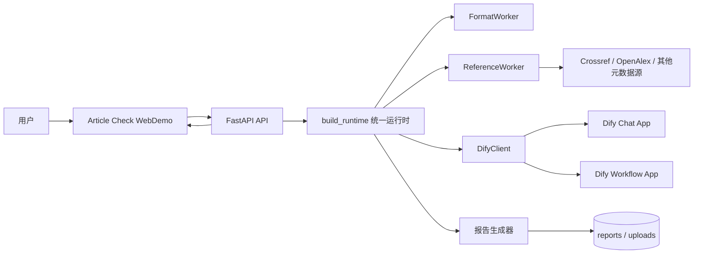
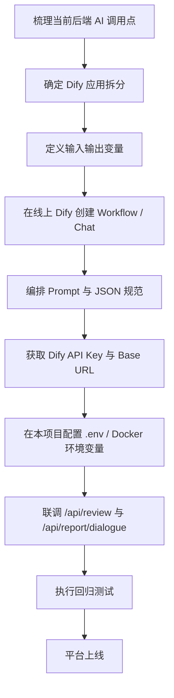
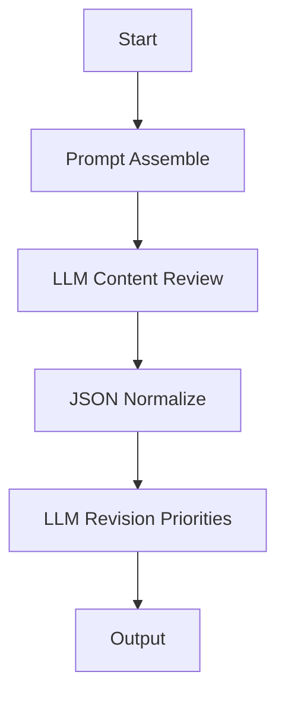

# Article Check Dify 移植流程与组件设计文档

## 1. 文档定位

- 文档名称：Article Check Dify 移植流程与组件设计文档
- 文档版本：v1.0
- 目标：指导将当前论文审查系统以“WebDemo 保持不变、AI 工作流迁移到 Dify”的方式完成平台化落地
- 适用对象：后端工程师、平台工程师、Dify 编排人员、项目方部署人员

## 2. 迁移目标

本次移植不是把整个系统重写成 Dify 原生页面，而是把当前系统中的 AI 决策与问答节点抽取出来，迁移为 Dify 可编排、可运营、可替换的能力层。

迁移后目标形态如下：

- Web 页面仍由 Article Check 承担
- 文件上传、格式规则检查、参考文献核验、报告生成仍在本项目后端
- Dify 接管：
  - 内容审查
  - 修订建议生成
  - 报告问答
- 后端通过 Dify Service API 访问 Chat 或 Workflow

## 3. 迁移边界

### 3.1 保留在 Article Check 的部分

以下能力不建议迁入 Dify：

1. 文件上传与落盘
2. 格式规则检查
3. DOI / Crossref / OpenAlex 核验
4. `article_check.ai_review.v1` 报告装配
5. 正式审改报告 HTML/Markdown/JSON 生成
6. Evidence 与原文片段联动
7. 专业 Web 工作台 UI

### 3.2 迁入 Dify 的部分

以下能力最适合迁入 Dify：

1. 内容性审查
2. 修订优先级建议生成
3. 围绕报告的问答
4. 平台统一对话入口
5. 可替换的 Prompt / Workflow 运维

## 4. 目标架构图



## 5. 当前代码中的 Dify 接入点

### 5.1 Provider 工厂

后端通过 `article_check.llm.client.__init__` 中的工厂决定当前 AI Provider：

- `ARTICLE_CHECK_AI_PROVIDER=dify` 时实例化 `DifyClient`
- 否则实例化 `DeepSeekClient`

### 5.2 统一 AI 客户端

`DifyClient` 提供两类核心能力：

1. `chat()`
   - 对应 Dify Chat App
2. `structured_chat()`
   - 对应“严格 JSON 输出”的结构化工作流调用

### 5.3 运行时接入点

`build_runtime()` 在内容审查可用时注册 `ContentWorker(harness, create_ai_client())`，意味着：

- 格式与参考文献仍为确定性链路
- 内容审查能力由统一 AI Client 提供

### 5.4 报告问答接入点

`answer_report_question()` 会优先检测 AI Provider 是否可用：

- 若可用，则走 `client.chat(...)`
- 若失败，则回退到规则回答

## 6. 推荐的 Dify 应用拆分

### 6.1 应用 A：`ArticleCheck_Review_Workflow`

- 类型：`Workflow`
- 作用：执行内容审查与修订建议生成
- 调用入口：后端内容审查链路
- 输出类型：结构化 JSON

### 6.2 应用 B：`ArticleCheck_Report_Chat`

- 类型：`Chat`
- 作用：围绕现有结构化报告做问答
- 调用入口：`/api/report/dialogue`
- 输出类型：自然语言回答

### 6.3 为什么至少拆成两个应用

原因如下：

1. 内容审查是结构化任务，适合 Workflow
2. 报告问答是会话型任务，适合 Chat
3. 两类任务的输入上下文和输出约束差异很大
4. 便于项目方后续分别运营 Prompt、模型和权限

## 7. Dify 迁移总流程

### 7.1 迁移流程图



### 7.2 实施步骤说明

#### 步骤 1：确认迁移边界

明确只迁 AI 能力，不迁 UI、文件处理和报告渲染。

#### 步骤 2：整理后端输入上下文

确保后端在调用 Dify 前已经能够产出：

- 论文标题
- 论文片段
- 格式检查结果
- 参考文献检查结果
- 审查目标
- 模板信息

#### 步骤 3：创建 Dify Workflow

在 Dify 平台创建 `ArticleCheck_Review_Workflow`，并配置固定输入输出变量。

#### 步骤 4：创建 Dify Chat

在 Dify 平台创建 `ArticleCheck_Report_Chat`，用于报告问答。

#### 步骤 5：完成环境变量配置

在本项目中配置：

```env
ARTICLE_CHECK_AI_PROVIDER=dify
DIFY_BASE_URL=https://your-dify-host/v1
DIFY_API_KEY=app-your-key
DIFY_APP_TYPE=workflow
DIFY_RESPONSE_MODE=blocking
DIFY_WORKFLOW_QUERY_KEY=query
DIFY_INPUTS_JSON={}
```

对于报告问答场景，可切换或单独部署为：

```env
DIFY_APP_TYPE=chat
```

#### 步骤 6：完成接口联调

至少联调以下两条链路：

1. `/api/review`
2. `/api/report/dialogue`

#### 步骤 7：完成上线验收

验证：

- 内容审查是否正常返回
- 报告问答是否回答稳定
- 正式报告是否仍正常生成
- 页面是否仍可正常打开与导出

## 8. 组件映射关系

| 当前组件 | 当前职责 | Dify 对应组件 | 是否迁移 | 说明 |
| --- | --- | --- | --- | --- |
| `ReviewPage` / `ReviewStudio` | Web 工作台 | 无 | 否 | 保留在 WebDemo |
| `server.py` | API 入口与 SPA 托管 | 无 | 否 | 保留在本项目 |
| `FormatWorker` | 格式规则检查 | 无 | 否 | 确定性规则，不适合迁入 |
| `ReferenceWorker` | 参考文献核验 | 可选 HTTP Node | 原则上否 | 仍建议留在本项目 |
| `ContentWorker` | 内容审查 | Workflow LLM Node | 是 | 主要迁移对象 |
| `answer_report_question()` | 报告问答 | Chat App | 是 | 迁移问答能力 |
| `generate_formal_review_report()` | 正式报告生成 | 无 | 否 | 保留在本项目 |
| `DifyClient` | Dify API 代理 | Dify Service API | 是 | 已实现，继续沿用 |

## 9. Workflow 应用设计

### 9.1 Workflow 名称

`ArticleCheck_Review_Workflow`

### 9.2 推荐输入变量

| 变量名 | 类型 | 说明 |
| --- | --- | --- |
| `paper_title` | string | 论文标题 |
| `paper_excerpt` | string | 后端切出的核心论文片段 |
| `format_findings_json` | string | 格式检查结果 JSON 字符串 |
| `reference_findings_json` | string | 文献检查结果 JSON 字符串 |
| `review_goal` | string | 例如“本科毕业论文送审前复核” |
| `template_name` | string | 模板名称，可为空 |

### 9.3 推荐输出变量

| 变量名 | 类型 | 说明 |
| --- | --- | --- |
| `review_result` | object / string | 内容审查结构化结果 |
| `priority_actions` | object / string | 修订优先级建议 |
| `executive_summary` | string | 执行摘要 |

### 9.4 Workflow 节点图



### 9.5 节点详细说明

#### 节点 1：Start

职责：

- 接收后端传入变量
- 保证变量名稳定

#### 节点 2：Prompt Assemble

职责：

- 把论文片段、格式问题、文献问题、审查目标拼为统一上下文
- 限制提示词长度，避免将整个论文全文直接传入

建议输出：

- `review_context`

#### 节点 3：LLM Content Review

职责：

- 对论文质量进行结构化内容审查
- 关注逻辑性、清晰性、完整性、方法合理性、结果表达

建议 Prompt 约束：

- 必须只基于输入上下文回答
- 必须输出合法 JSON
- 不得输出代码块包装

建议输出结构：

```json
{
  "score": 0.0,
  "summary": "string",
  "strengths": ["string"],
  "weaknesses": ["string"],
  "issues": [
    {
      "section": "string",
      "type": "logic|clarity|completeness|methodology|result",
      "severity": "minor|major|critical",
      "description": "string",
      "suggestion": "string"
    }
  ]
}
```

#### 节点 4：JSON Normalize

职责：

- 校验字段完整性
- 统一 `severity` 枚举
- 修补空列表和空字符串
- 保证最终输出是后端可解析的 JSON

#### 节点 5：LLM Revision Priorities

职责：

- 基于内容审查、格式问题、文献问题生成修订优先级
- 输出 3 至 5 条优先修订建议

建议输出结构：

```json
[
  {
    "priority": "critical",
    "title": "先修复引用完整性问题",
    "actions": [
      "补齐 reference 章节",
      "核对正文引用与条目映射"
    ]
  }
]
```

#### 节点 6：Output

职责：

- 输出 `review_result`
- 输出 `priority_actions`
- 输出 `executive_summary`

## 10. Chat 应用设计

### 10.1 Chat 名称

`ArticleCheck_Report_Chat`

### 10.2 推荐输入变量

| 变量名 | 类型 | 说明 |
| --- | --- | --- |
| `report_payload` | string | 完整结构化报告 JSON 字符串 |
| `user_question` | string | 用户追问 |

### 10.3 推荐 System Prompt

```text
你是论文审改助手。必须严格基于 report_payload 回答，不得编造报告中不存在的事实。
你的回答必须：
1. 优先指出高严重度问题；
2. 面向作者修改动作；
3. 尽量给出定位依据；
4. 避免空泛鼓励和重复套话。
```

### 10.4 输出要求

- 简洁
- 可执行
- 以问题优先级组织
- 优先引用报告中已有问题类别和证据

## 11. 后端字段映射规范

### 11.1 `/api/review` 到 Dify Workflow

后端推荐按如下顺序接入：

1. 本地完成格式检查
2. 本地完成参考文献检查
3. 抽取 `paper_excerpt`
4. 组装 Workflow 输入
5. 调用 `ArticleCheck_Review_Workflow`
6. 解析输出
7. 合并到 `article_check.ai_review.v1`
8. 生成正式报告 HTML/Markdown/JSON

### 11.2 `/api/report/dialogue` 到 Dify Chat

后端推荐按如下顺序接入：

1. 接收 `report_payload` 与 `question`
2. 拼装 Chat messages
3. 调用 `ArticleCheck_Report_Chat`
4. 返回回答文本

## 12. 环境变量与部署要求

### 12.1 最小环境变量集

```env
ARTICLE_CHECK_AI_PROVIDER=dify
DIFY_BASE_URL=https://api.dify.ai/v1
DIFY_API_KEY=app-your-key
DIFY_APP_TYPE=chat
DIFY_RESPONSE_MODE=blocking
DIFY_WORKFLOW_QUERY_KEY=query
DIFY_INPUTS_JSON={}
```

### 12.2 Docker 场景建议

- WebDemo 服务仍由 `docker-compose.yml` 承载
- Dify 地址通过 `.env` 注入，不硬编码
- 若 Dify 与本项目在不同宿主机，需保证网络可达
- 若项目方使用自托管 Dify，需确认：
  - 网关域名
  - API Key
  - CORS / 网络白名单
  - TLS 证书

## 13. 联调清单

### 13.1 功能联调

1. Dify Workflow 返回是否为合法 JSON
2. 内容审查结果是否能合并进入 `findings`
3. 优先级建议是否能进入 `advice_report`
4. 报告问答是否能返回简洁稳定回答
5. AI 异常时是否能正确回退

### 13.2 性能联调

1. 单篇论文响应时间
2. 批量任务是否出现超时
3. Dify 阻塞模式下是否影响页面交互
4. 网络抖动时的失败重试策略

### 13.3 输出验收

1. 正式报告仍可生成
2. Evidence 与原文片段联动不受影响
3. 评分、问题数、优先级建议正常显示
4. `/api/status` 能正确显示 Provider 状态

## 14. 风险与应对

### 14.1 风险：把过多规则迁入 Dify

问题：

- 工作流会非常重
- 难以维护
- 难以保证确定性

应对：

- 只迁 AI 节点，不迁规则引擎

### 14.2 风险：Workflow 输出不稳定

问题：

- LLM 可能输出非法 JSON

应对：

- 在 Dify 侧增加 Normalize 节点
- 在后端继续保留 JSON 修复兜底

### 14.3 风险：平台方误以为 Dify 能替代全部系统

问题：

- 会导致 UI、文件系统、报告导出全部重做

应对：

- 明确 Dify 只承担 AI 编排层
- WebDemo 仍是项目交付主界面

## 15. 分阶段落地建议

### Phase 1：先迁报告问答

原因：

- 接入最轻
- 对现有主流程冲击最小
- 便于先验证 Dify 可用性

### Phase 2：再迁内容审查 Workflow

原因：

- 能够把 AI 审查节点从单模型抽象为平台能力

### Phase 3：最后做平台运营化

包括：

- Prompt 版本管理
- 工作流版本发布
- 失败告警
- 配额与成本控制

## 16. 最终结论

对于当前项目，最优迁移策略不是“把论文审查系统改写成 Dify 应用”，而是：

1. 保留 Article Check WebDemo 作为专业工作台
2. 保留 FastAPI 作为业务编排与报告生成层
3. 将内容审查与报告问答迁移为 Dify 的 Workflow 与 Chat 能力
4. 通过环境变量和统一 AI Client 完成无侵入切换

这一路线兼顾了：

- 页面专业性
- 系统可运营性
- 项目方平台集成便利性
- 后续 AI 能力可替换性

