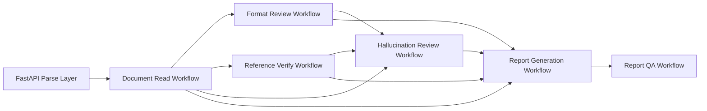

# Dify Workflow Optimization Architecture

## 1. Goal

本轮优化的目标不是简单增加 Prompt 长度，而是把当前论文审改平台的 Dify 层升级为一条可编排、可追踪、可审计的工作流总线。

优化重点：

1. 统一输入输出契约，减少 FastAPI 与各 Workflow 之间的胶水代码。
2. 让 `Format Review`、`Reference Verify`、`Hallucination Review` 真正形成协同关系，而不是各自独立判断。
3. 为后续的报告问答智能体提供 `question_router_hints`、`qa_seed_questions`、`evidence_records` 等结构化材料。
4. 借鉴 `DeepResearch.yml` 的“路由提示、阶段拆解、结果聚合”思想，但不把主审查链路直接做成高风险的复杂迭代 Agent。

## 2. Optimized Pipeline

## 3. Interface Bus

### 3.1 Document Read Output Bus

`Document Read Workflow` 现在建议作为统一总线入口，向后续流程输出：

- `paper_profile`
- `template_rule_profile`
- `requirement_rule_profile`
- `review_context`
- `routing_hints`
- `normalization_meta`

详细模式下再输出：

- `section_digest`
- `evidence_index`
- `risk_hints`

### 3.2 Why This Matters

- `routing_hints` 让 Dify 不必每个下游节点都重新猜测审查重点。
- `normalization_meta` 让下游知道当前 bundle 是否完整，避免“缺数据时强行下结论”。
- `evidence_index` 让格式审查、引文核验、报告问答共用证据定位线索。
- `risk_hints` 作为弱监督提示，只给出“优先关注区域”，不提前替代结论。

## 4. Workflow Responsibilities

### 4.1 Document Read

职责：

- 归一化三类 bundle
- 产出 review bus
- 生成 routing hints
- 生成 evidence index

不负责：

- 直接判定格式错误
- 直接判定事实造假或幻觉

### 4.2 Format Review

职责：

- 接住解析器给出的确定性格式指标
- 补足结构与规范类弱格式问题
- 输出 `handoff_to_hallucination`

优化后新增输入：

- `section_digest_json`
- `evidence_index_json`
- `risk_hints_json`

优化后新增输出建议：

- `meta`
- `handoff_to_hallucination`
- `workflow_trace`

协同边界：

- 结构缺失、标题层级、摘要规范这类问题由 `Format Review` 先做初筛。
- `Hallucination Review` 不重复把纯格式结构缺陷再标成幻觉。

### 4.3 Reference Verify

职责：

- 对外部核验结果做保守审计式归纳
- 区分高风险、待人工复核、证据不足
- 把引文线索整理给幻觉审查和报告生成

优化后新增输入：

- `section_digest_json`
- `evidence_index_json`

优化后新增输出建议：

- `citation_map`
- `handoff_to_hallucination`
- `workflow_trace`

### 4.4 Hallucination Review

职责：

- 审查 claim / citation / structure 三类风险
- 引用 `Format Review` 和 `Reference Verify` 的结论，避免重复判断

优化后新增输入：

- `section_digest_json`
- `evidence_index_json`
- `format_review_json`
- `reference_review_json`

优化后新增输出建议：

- `cross_workflow_refs`
- `qa_focus_hints`
- `workflow_trace`

关键原则：

- 格式问题优先由 `Format Review` 定义。
- 引文命中和元数据不一致优先由 `Reference Verify` 定义。
- `Hallucination Review` 负责把二者提升为“论断支撑关系”的审计判断。

### 4.5 Report Generation

职责：

- 汇总三类审查结果
- 生成统一 findings
- 生成证据卡片
- 生成可供问答智能体消费的路由提示

优化后新增输入：

- `section_digest_json`
- `evidence_index_json`

优化后新增输出建议：

- `question_router_hints`
- `qa_seed_questions`
- `workflow_trace`

## 5. Agent Strategy

## 5.1 Why Not Make Everything DeepResearch-Style

`DeepResearch.yml` 的强项是：

- 主题拆解
- 迭代搜索
- 变量累积
- 最终总结

但主审改链路的核心诉求是确定性、稳定导入、可复核，因此不建议把：

- 文档读取
- 格式审查
- 核验归纳
- 报告生成

全部直接改造成迭代式 Agent。

更适合的做法是：

1. 主链路保持 `workflow` 的稳定可编排。
2. 将 Agent 化能力集中放在报告问答、补充研究、疑难引文追问等交互层。

## 5.2 Recommended Agentic Layer

建议把“智能体感”集中在：

- `Report QA Workflow`
- 未来可选的 `Research Copilot / Citation Deep Dive` 工作流

其中 `Report QA` 现在已经接入：

- `question_scope`
- `answer_style`
- `question_router_hints`

这意味着问答层可以开始承担轻量路由，而主生产链路仍保持稳定。

## 6. FastAPI Orchestration Advice

推荐的 FastAPI 编排顺序：

1. 调用解析器，生成 `paper_bundle_json`、`template_bundle_json`、`requirement_bundle_json`
2. 调用 `Document Read Workflow`
3. 从结果中拆出：
   - `paper_profile_json`
   - `template_rule_profile_json`
   - `requirement_rule_profile_json`
   - `review_context_json`
   - `section_digest_json`
   - `evidence_index_json`
   - `risk_hints_json`
4. 并行调用：
   - `Format Review Workflow`
   - `Reference Verify Workflow`
5. 调用 `Hallucination Review Workflow`
   - 输入 `format_review_json`
   - 输入 `reference_review_json`
6. 调用 `Report Generation Workflow`
7. 用户交互阶段调用 `Report QA Workflow`

## 7. Current Practical Conclusion

当前最优策略是：

- 保持现有 5 条主工作流为稳定 `workflow`
- 用统一 bus 契约提升上下游耦合质量
- 让 `Format Review` 和 `Hallucination Review` 形成职责边界
- 让 `Report Generation` 产出更适合智能体问答消费的结构化提示
- 将 DeepResearch 风格能力留给补充研究层，而不是污染主审计链路
